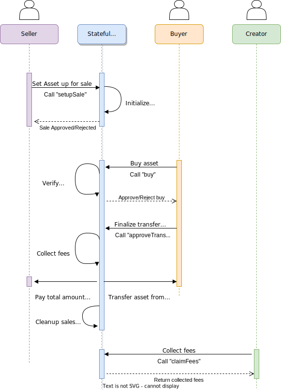

# Royalty Fees on Algorand
This is a short tutorial that explains how to implement Royalty Fees using Inner Transactions and Teal v5 capabilities in Algorand.
The smart contract has been written in PyTeal, and all the examples are written using Typescript.

We assume that the reader has programming knowledge, and that she/he is already familiarity with Blockchains technology.

## 1. Introduction
**Royalty Fees play a huge role in the future of Blockchains, since they enable the possibility of guaranteeing fees  on second sales of an asset.** Unfortunately, Royalty Fees are yet not fully implemented on Blokchains. 

For example, [in Ethereum it is not possible to enforce Royalty fees on second sales](https://eips.ethereum.org/EIPS/eip-2981). As a consequence, marketplaces in Ethereum have to implement an internal solution to provide Royalty Fees, which can be easily avoided if the users avoid selling on that specific marketplace.

**Algorand on the other hand has some features that make it a candidate blockchain where to implement Royalty Fees**. These features are:
1. Possibility to freeze an asset, and block the transfer of an asset
2. Possibility to send transactions and move assets using smart contracts (Teal 5)

**An earlier project on Algorand, [Algorealm](https://github.com/cusma/algorealm), shows a first implementation of Royalty Fees on Algorand by using a [**clawback** address](https://developer.algorand.org/docs/get-details/transactions/transactions#clawbackaddr) and Teal v2**. However, the smart contract implemented in Algorealm  (which is the union of a [Stateful App](https://developer.algorand.org/docs/get-details/dapps/smart-contracts/apps/) and 1 [Smart signature](https://developer.algorand.org/docs/get-details/dapps/smart-contracts/smartsigs/)) only accepts or rejects the transfer of an asset, and it is not able to  compute automatically a royalty fee, or too automatically move an asset. In their proposal they make use of a smart contract that allows the transfer of an asset only upon payment of a specific royalty fee. Because of these limitations, their implementation is application-specific, and hard to scale.

**Now it is possible to do much better by exploiting the capabilities of Teal v5**. It is possible to implement only 1 [stateful App](https://developer.algorand.org/docs/get-details/dapps/smart-contracts/apps/) that handles automatically the payment of royalty fees, and the transfer of assets using [Inner Transactcions](https://developer.algorand.org/docs/get-details/dapps/smart-contracts/apps/?from_query=inner%20transactions#inner-transactions).

## 2. Method to collect royalty fees
**Roughly speaking, the method works as follows:**
1. The seller sets up an asset for sale on the App (the smart contract)
2. The buyer pays the amount specified by the seller to the App
3. If the buyer is fully convinced he/she can continue with the payment
   * The asset is transfered from the seller to the buyer
   * The app pays the seller the total amount minus the royalty fees
   * Royalty fees are collected in the App. The owner of the royalty fees (the Creator of the asset) can redeem the royalty fees whenever he/she wants.

The method is also described the following UML diagram

One may wonder why it is necessary for the Buyer to first pay and then finalize the transfer. I personally prefer it this way. How many times you bought something and then you regretted doing so?

In case you don't like this solution, it is still possible to combine all the steps together (I will explain this later).

## 3. Creating the contract (approval program)

### 3.1 Subroutines
### 3.2 Initialization
### 3.3 SetupSale method
### 3.4 BuyASA method
### 3.5 ExecuteTransfer method
### 3.6 SetupSale method
### 3.7 Refund Method
### 3.8 claimFees Method

## 4. Setting up an Example scenario
### 4.1 Creating the asset
### 4.2 Creating the App
### 4.3 Simulate sales
### 4.4 Verify royalty fees

## 5. Conclusions

